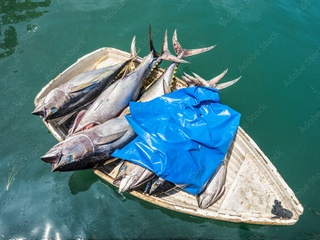

# 02 – Adding markers and vectors; layers control

## Markers
Adding a marker (a "pushpin") to the map is very simple using the ```L.marker()``` function:
``` javascript
            // add a marker
            var m = L.marker([47.4749, 19.0622]).addTo(map);
```

## Popups, tooltips
You can bind a popup (an info window that appears on mouse click) or  tooltip (a small hint text that appears on mouse hover) to markers:

``` javascript
            // bind tooltip
            m.bindTooltip('You are here');
            
            // bind popup
            m.bindPopup('This is the Institute of Cartography and Geoinformatics, venue of this Summer School')
                .openPopup();
```

Tooltip and popup content may also contain HTML formatting. 
The openPopup() method opens the popup window (it might come in handy to have it opened when loading the page.)

## Task 1
Create an advertisement page for a fisherman who is selling his fish from a boat on Lake Balaton. 
The ad should contain a map, displaying the position of the boat (46.88682, 17.90299). Bind a popup with opening hours and a picture to the marker.
You can use [this sample image]({{ site.baseurl }}/images/fish_boat.jpg) if you need

## Polygons
Adding a polygon to the map is also very simple. Use the ```L.polygon()``` function and specify the polyagon coordinates as an 'array of arrays':

``` javascript
            // add a polygon
            var a = L.polygon([[46.92, 17.91],[46.97, 18.12],[46.94, 17.93]])
                .addTo(map);
```

Polylines can be added similarly, using the ```L.polyline()``` function.
## Task 2
On the previously created map, indicate the area where the fisherman catch fish. The bounding coordinates are: [[46.9056, 17.9578],[46.9239, 18.0553],[46.9769, 18.1260],[47.0054, 18.056],[46.9422, 17.9291]]

## Layers control
In leaflet, each marker and polygon forms a layer, these, together with tiled map layers can be switched on and off using the Layers Control.

There are two types of layers:
- Base layers are used as "background map". These map layers usually consist of fully opaque images, therefore only one of them can be visible at a time.
- Overlays are additional map layers that can be "overlaid" on base layers and other overlays. These layers an be displayed simultaneously.

Before creating and adding the Layers Control to our map, those layers that are planned to be included in the control, should be stored in variables. It is also advisable to create JavaScript objects for layer selection, one for base layers and another for overlays before creating the control:

``` javascript
            // add a tiled map layer with OpenStreetMap tiles
            var osm = L.tileLayer('https://tile.openstreetmap.org/{z}/{x}/{y}.png', {
                attribution: '&copy; <a href="http://www.openstreetmap.org/copyright">OpenStreetMap</a>'
            });
            
            // add a tiled map layer with OpenTopoMap tiles
            var otm = L.tileLayer('https://tile.opentopomap.org/{z}/{x}/{y}.png', {
                attribution: 'Data: &copy; <a href="http://www.openstreetmap.org/copyright">OpenStreetMap</a>, rendering: : &copy; <a href="http://www.opentopomap.org">OpenTopoMap</a>'
            }).addTo(map);
            
            // add a marker
            var m = L.marker([46.88682, 17.90299]).addTo(map)
                .bindTooltip('My fishing boat')
                .bindPopup('<h3>Best fishes</h3>Open: daily 7:00-15:00<br/>')
                .openPopup();
            
            // add a polygon
            var a = L.polygon([[46.9056, 17.9578],[46.9239, 18.0553],[46.9769, 18.1260],[47.0054, 18.056],[46.9422, 17.9291]])
                .addTo(map)
                .bindTooltip('My fishing area')
                .bindPopup('My fishing area');
                
            // base layers
            var base = {
                'OpenStreetMap': osm,
                'OpenTopoMap': otm
            }
            
            // overlays
            var ovl = {
                'Boat': m,
                'Fishing area': a
            }
            
            // create and add Layers Control
            L.control.layers(base,ovl).addTo(map);
```

## Task 3

Complete your map with a layers control. Use OpenStreetMap and OpenTopoMap as possible base layers, while the position of the boat and the fishing area should be overlays.

